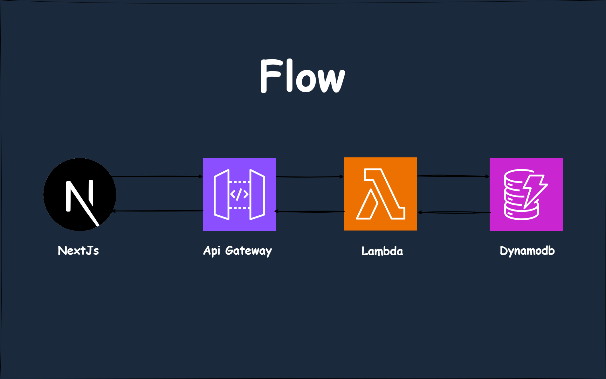

# Readup- Full-Stack CRUD Application



A modern, full-stack Book Library application built with **Next.js 14**, **TypeScript**, **Tailwind CSS**, and **AWS services** (DynamoDB, Lambda, API Gateway). This application demonstrates enterprise-level CRUD operations with a serverless architecture.

## Features

- ** Complete Book Management**: Create, read, update, and delete books
- ** Modern UI**: Clean, responsive design with Tailwind CSS
- ** Server-Side Rendering**: Built with Next.js 14 App Router
- ** Serverless Architecture**: AWS Lambda functions with API Gateway
- ** NoSQL Database**: DynamoDB for scalable data storage
- ** Type Safety**: Full TypeScript implementation
- ** Responsive Design**: Mobile-first approach
- ** SEO Optimized**: Server-side rendering for better search visibility

##  Tech Stack

### Frontend
- **Next.js 14** - React framework with App Router
- **TypeScript** - Type-safe JavaScript
- **Tailwind CSS** - Utility-first CSS framework
- **React Hooks** - State management

### Backend & Cloud
- **AWS Lambda** - Serverless compute functions
- **AWS API Gateway** - RESTful API management
- **AWS DynamoDB** - NoSQL database

### Development Tools
- **ESLint** - Code linting
- **PostCSS** - CSS processing
- **Geist Fonts** - Modern typography

## 📁 Project Structure

```
book-library-next-dynamo-main/
├── app/                    # Next.js 14 App Router
│   ├── [id]/              # Dynamic route for book details
│   │   └── page.tsx       # Edit/Delete book page
│   ├── add/               # Add new book route
│   │   └── page.tsx       # Add book form
│   ├── fonts/             # Custom font files
│   ├── globals.css        # Global styles
│   ├── layout.tsx         # Root layout component
│   └── page.tsx           # Home page (book list)
├── actions/               # Server actions and API calls
│   ├── actions.ts         # Server-side action wrappers
│   └── data.ts            # AWS API integration functions
├── components/            # Reusable UI components
│   ├── BookCard.tsx       # Individual book display card
│   └── Header.tsx         # Navigation header
├── types.ts               # TypeScript type definitions
├── tailwind.config.ts     # Tailwind CSS configuration
├── next.config.mjs        # Next.js configuration
└── package.json           # Dependencies and scripts
```

## Getting Started

### Prerequisites

- **Node.js** (v18 or later)
- **npm** or **yarn**
- **AWS Account** with appropriate permissions
- **AWS CLI** configured (optional, for advanced setup)

### 1. Clone the Repository

```bash
git clone //
cd //
```

### 2. Install Dependencies

```bash
npm install
# or
yarn install
```

### 3. Environment Configuration

Create a `.env.local` file in the root directory:

```bash
# Copy from example
cp .env.example .env.local
```

Add your AWS API Gateway URL:

```env
AWS_API_URL=https://your-api-gateway-url.amazonaws.com/prod
```

### 4. AWS Setup (Required)

You need to set up the following AWS services:

1. **DynamoDB Table**
   - Table name: `Books` (or configure as needed)
   - Primary key: `id` (Number)

2. **Lambda Functions**
   - Create CRUD operations for books
   - Configure appropriate IAM roles

3. **API Gateway**
   - Set up REST API endpoints
   - Configure CORS for your domain

See [AWS Setup Guide](#aws-setup-detailed) for detailed instructions.

### 5. Run Development Server

```bash
npm run dev
# or
yarn dev
```

Open [http://localhost:3000](http://localhost:3000) to view the application.

## 🔧 Available Scripts

```bash
npm run dev      # Start development server
npm run build    # Build production application
npm run start    # Start production server
npm run lint     # Run ESLint for code quality
```

## API Endpoints

The application expects the following API endpoints from your AWS Lambda/API Gateway setup:

| Method | Endpoint | Description |
|--------|----------|-------------|
| GET | `/books` | Retrieve all books |
| GET | `/books/{id}` | Retrieve a specific book |
| PUT | `/books` | Create or update a book |
| DELETE | `/books/{id}` | Delete a specific book |

## Key Components

### BookCard Component
Displays individual book information with view/edit functionality.

### Header Component
Navigation header with home link and add book button.

### Server Actions
- **getBookFromDB**: Fetch individual book data
- **putBookInDB**: Create or update book
- **deleteBookInDB**: Remove book from database

## Deployment

### Vercel (Recommended)

1. Push your code to GitHub
2. Connect your repository to Vercel
3. Add environment variables in Vercel dashboard
4. Deploy!

Ensure environment variables are properly configured on your chosen platform.

## Troubleshooting

### Common Issues

1. **API Connection Failed**
   - Verify `AWS_API_URL` is correctly set
   - Check AWS API Gateway CORS configuration
   - Ensure Lambda functions are deployed

2. **Build Errors**
   - Run `npm install` to ensure all dependencies are installed
   - Check TypeScript errors with `npm run build`

3. **Styling Issues**
   - Ensure Tailwind CSS is properly configured
   - Check for conflicting CSS classes

## Contributing

1. Fork the repository
2. Create a feature branch: `git checkout -b feature/amazing-feature`
3. Commit changes: `git commit -m 'Add amazing feature'`
4. Push to branch: `git push origin feature/amazing-feature`
5. Open a Pull Request

## 📝 License

This project is open source and available under the [MIT License](./LICENCE).

## 🙋‍♂️ Support

If you have any questions or need help with setup, please:
1. Check the troubleshooting section
2. Review the AWS setup guide
3. Open an issue on GitHub

## 🎯 Roadmap

- [ ] Add search functionality
- [ ] Implement book categories
- [ ] Add image upload for book covers
- [ ] User authentication system
- [ ] Book rating and reviews
- [ ] Advanced filtering options
