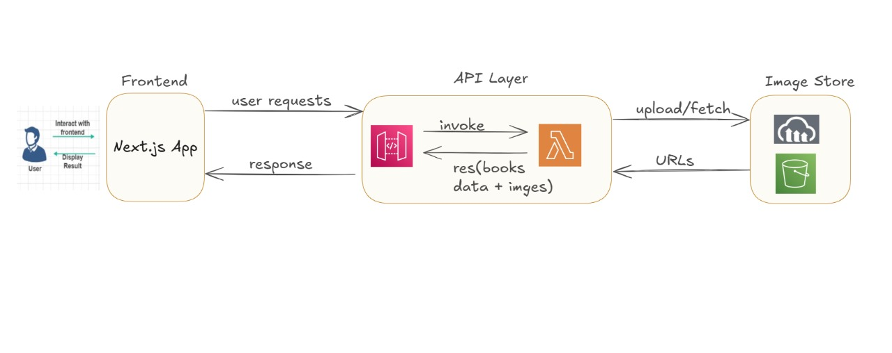

# ReadUp — Serverless Book Library (Next.js 14 + AWS)

[](#)
[](#)
[](#)
[](#)
[](#)

A production-ready, full-stack book management app with a serverless backend.  
Frontend: **Next.js 14 (App Router), TypeScript, Tailwind CSS**  
Backend: **AWS Lambda, API Gateway, DynamoDB, S3**, plus **Cloudinary** for image delivery.

---

## Table of Contents
- [Features](#features)
- [Tech Stack](#tech-stack)
- [Project Structure](#project-structure)
- [Getting Started](#getting-started)
  - [Prerequisites](#prerequisites)
  - [Setup](#setup)
  - [Environment Variables](#environment-variables)
  - [Run Locally](#run-locally)
- [AWS Infrastructure](#aws-infrastructure)
- [Scripts](#scripts)
- [Key Modules](#key-modules)
- [Deployment](#deployment)
- [Troubleshooting](#troubleshooting)
- [Contributing](#contributing)
- [License](#license)

---

## Features
- CRUD for books (create, read, update, delete)
- Responsive UI with Tailwind CSS
- SSR/SSG via Next.js App Router
- Serverless API via Lambda + API Gateway
- Scalable NoSQL with DynamoDB
- Asset storage on S3; optimized delivery via Cloudinary
- End-to-end TypeScript

---
## Architecture Flow


*System architecture showing the flow from frontend to serverless backend*

## Tech Stack

**Frontend**
- Next.js 14 (App Router)
- TypeScript (strict)
- Tailwind CSS
- React Hooks

**Backend & Cloud**
- AWS Lambda (serverless functions)
- AWS API Gateway (REST)
- AWS DynamoDB (NoSQL)
- AWS S3 (object storage)
- Cloudinary (image CDN/optimization)

**Tooling**
- ESLint
- PostCSS
- Geist Fonts

---

## Project Structure
```
readup/
├── app/                    # Next.js routes & layouts
│   ├── [id]/page.tsx       # Book details / edit
│   ├── add/page.tsx        # Add book
│   ├── globals.css
│   ├── layout.tsx
│   └── page.tsx            # Book list (home)
├── actions/                # Server actions & API wrappers
│   ├── actions.ts
│   └── data.ts
├── components/             # Reusable UI
│   ├── BookCard.tsx
│   └── Header.tsx
├── types.ts                # Shared types
├── tailwind.config.ts
├── next.config.mjs
└── package.json
```

---

## Getting Started

### Prerequisites
- Node.js **18+**
- npm or yarn
- AWS account with permissions for **Lambda, API Gateway, DynamoDB, S3**
- (Optional) AWS CLI configured

### Setup
```bash
git clone <your-repo-url> readup
cd readup
npm install
# or: yarn install
```

### 3. Environment Configuration

Create a `.env.local` file in the root directory:

```bash
# Copy from example
cp .env.example .env.local
```

Add your AWS API Gateway URL:

```env
AWS_API_URL=https://your-api-gateway-url.amazonaws.com/prod
```

### Run Locally

```bash
npm run dev
# or: yarn dev
```

Visit [http://localhost:3000](http://localhost:3000)

---

## AWS Infrastructure

* **DynamoDB**: table `Books` with primary key `id` (Number or String—be consistent across API & app)
* **Lambda**: functions for book CRUD
* **API Gateway**: REST endpoints proxying to Lambda; enable CORS for your app origin
* **S3**: optional storage for original images/files
* **Cloudinary**: CDN + transformations for book cover images

> Keep IAM roles least-privileged. Validate inputs at the edge (API) and in Lambdas.

---

## Scripts

```bash
npm run dev       # Start dev server
npm run build     # Production build
npm run start     # Start production server
npm run lint      # Lint codebase
```

---

## Key Modules

* **actions/data.ts** — API integration (fetchers to AWS API Gateway)
* **actions/actions.ts** — Server actions wrapping data access
* **components/BookCard.tsx** — Book display with edit/delete
* **components/Header.tsx** — Navigation with "Add Book"
* **app/[id]/page.tsx** — Detail/edit page
* **app/add/page.tsx** — Create new book

---

## Deployment

### Vercel (Recommended)

1. Push to GitHub
2. Import repo on Vercel
3. Configure environment variables (`AWS_API_URL`, etc.)
4. Deploy

> Ensure your API Gateway allows the Vercel domain(s) via CORS.

---

## Troubleshooting

* **API connection fails**
  * Verify `AWS_API_URL`
  * Check API Gateway CORS (origins, headers, methods)
  * Confirm Lambda deployment and permissions
* **Build errors**
  * Re-install deps (`npm install`)
  * Fix TypeScript/ESLint issues
* **Styling issues**
  * Confirm Tailwind config and `globals.css` import

---

## Contributing

1. Fork the repo
2. Create a feature branch: `git checkout -b feat/your-feature`
3. Commit: `git commit -m "feat: add your feature"`
4. Push & open a Pull Request

---

## License

This project is available under the [MIT License](./LICENSE).
